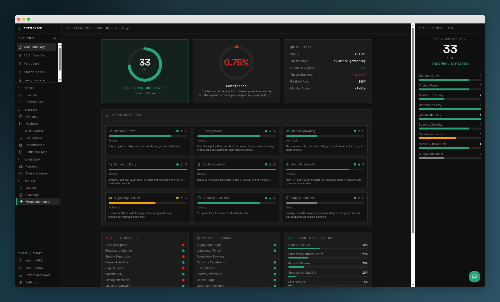

# Scarcity Scout

**Find the bottleneck. Own the scarcity. Build the thesis.**

Scarcity Scout is a structured investment research workbench for identifying, scoring, and stress-testing scarcity-driven investment theses — the kind of asymmetric setups where supply constraints meet surging demand and the market hasn't caught up yet.



---

## Why Scarcity Scout?

Most investment tools help you screen stocks. Scarcity Scout helps you think.

Instead of starting with tickers, you start with a **structural thesis** — a bottleneck in the real world (energy permitting backlogs, semiconductor fab lead times, rare-earth processing capacity) — and work through a disciplined framework to decide whether it's investable, how to express it, and what would break the thesis.

**The core workflow:**

1. **Thesis** → Define the structural shift, the bottleneck, and why now
2. **Evidence** → Verify scarcity signals with source-backed evidence items
3. **Value Capture** → Map the value chain to find who actually captures pricing power
4. **Expression** → Build a layered portfolio from core holdings to speculative satellites
5. **Monitor** → Set up confirming and disconfirming signals to track over time

Each step is guided by a synthesis block that tells you what the data says before you dive into the detail — so you spend time thinking, not scrolling.

---

## Key Features

### AI-Assisted Analysis (Ollama by Default)
One-click auto-fill generates a complete bottleneck analysis from a theme. **Ollama is the default AI provider** — run entirely against local open-source models with zero cloud dependency and full privacy. After every fill, an **AI Analyst Memo** surfaces the reasoning, fragile assumptions, and potential false friends — so the AI feels accountable, not magical.

### Live Data Feeds & Web Research
AI analyses are automatically enriched with **real-time context** from financial news and commodity data feeds (Reuters, CNBC, EIA, Mining.com, and more). Before the AI generates an analysis, the system fetches recent headlines relevant to your theme and injects them into the prompt — so the model reasons over current market conditions, not just its training data. Works with both local Ollama and cloud providers.

### Bring Your Own API Key
Prefer cloud models? Add your own **OpenAI** or **Anthropic** API key in Settings and specify any model your key supports. No built-in credits — you control your own usage and costs.

### Scarcity Heatmap
Nine-factor scoring system (scarcity severity, supply response speed, pricing power, barriers to entry, and more) with hover-over rubrics explaining exactly what a 1, 3, or 5 means for each factor. No ambiguous numbers.

### Bottleneck Map
Visual scatter plot of all your analyses on a scarcity-duration vs. market-mispricing grid. Instantly see which themes sit in the high-conviction quadrant.

### Portfolio Construction with Guardrails
A soft-gated portfolio builder that warns you if you're constructing positions before the thesis has earned it — minimum evidence thresholds, thesis breakers reviewed, confidence above baseline.

### Thesis Breakers
Structured checklist of what would kill the thesis (substitution risk, capital flood, demand decline, regulatory change) plus free-form disconfirming signals.

### Value Chain Mapper
Map entities across six layers — demand creators, bottleneck owners, infrastructure, picks & shovels, operators, and integrators — to find where value actually accrues.

### YAML & Markdown Export
Full round-trip import/export for portability, version control, and team sharing.

### Chat Interface
Conversational AI assistant with full context of your analyses for ad-hoc questions, brainstorming, and deep dives. Works with Ollama or your own cloud API key.

### 🤖 Agent-Friendly Architecture

Scarcity Scout is designed to be fully operable by AI agents — no UI required.

| Capability | Endpoint | Description |
|---|---|---|
| **MCP Server** | `/functions/v1/mcp` | Native [Model Context Protocol](https://modelcontextprotocol.io) endpoint with tools for listing, creating, updating, deleting, and auto-filling analyses. Connect from Claude Desktop, Cursor, or any MCP client. |
| **REST API** | `/functions/v1/api` | Standard CRUD with `GET`, `POST`, `PATCH`, `DELETE` and JSON responses. |
| **OpenAPI Spec** | `/functions/v1/openapi` | Machine-readable API description for auto-discovery of endpoints, schemas, and operations. |
| **Batch Operations** | `POST /functions/v1/api/batch` | Up to 50 create/update/delete operations in a single call. |
| **Webhooks** | `/functions/v1/webhooks` | Subscribe to `analysis.created`, `analysis.updated`, `analysis.deleted` events with conditional filters (e.g., "confidence < 50%") and optional HMAC signature verification. |

---

## Getting Started

### 1. Install & Run

```sh
npm install
npm run dev
```

### 2. Set Up Ollama (Recommended)

Scarcity Scout defaults to a local [Ollama](https://ollama.com) instance for AI features. Install Ollama, pull a model, and start the server with CORS enabled:

```sh
# Install Ollama: https://ollama.com/download
ollama pull llama3.2
OLLAMA_ORIGINS="*" ollama serve
```

Then open the app, go to **Settings**, click **Test** to verify the connection, and you're ready to auto-fill analyses.

### 3. Or Use a Cloud Provider

If you prefer cloud models, go to **Settings → AI Provider**, select **OpenAI** or **Anthropic**, and paste your API key. No other setup needed.

---

## Self-Hosting

Scarcity Scout uses Supabase for data persistence. To self-host:

1. Create a [Supabase](https://supabase.com) project
2. Run the migrations in `supabase/migrations/` against your database
3. Set environment variables:
   - `VITE_SUPABASE_URL` — your Supabase project URL
   - `VITE_SUPABASE_PUBLISHABLE_KEY` — your Supabase anon/public key
4. Deploy the edge functions in `supabase/functions/` to your project (only needed if using cloud AI providers via the chat or auto-fill features)

All AI calls are routed through **your** chosen provider — Ollama locally, or your own OpenAI/Anthropic key. There are no shared AI credits.

---

## Tech Stack

- **Frontend:** React · TypeScript · Vite · Tailwind CSS · shadcn/ui · Framer Motion
- **Backend:** Supabase (Postgres, Edge Functions)
- **AI:** Ollama (default, local) · OpenAI / Anthropic (BYO key)

---

## Who Is This For?

- **Thematic investors** building conviction around structural supply/demand imbalances
- **Analysts** who want a repeatable framework instead of ad-hoc spreadsheets
- **Portfolio managers** stress-testing bottleneck theses before sizing positions
- **Curious generalists** who want to think about markets through a scarcity lens

---

## License

MIT — Copyright (c) 2026 Drew Alan Hicks
